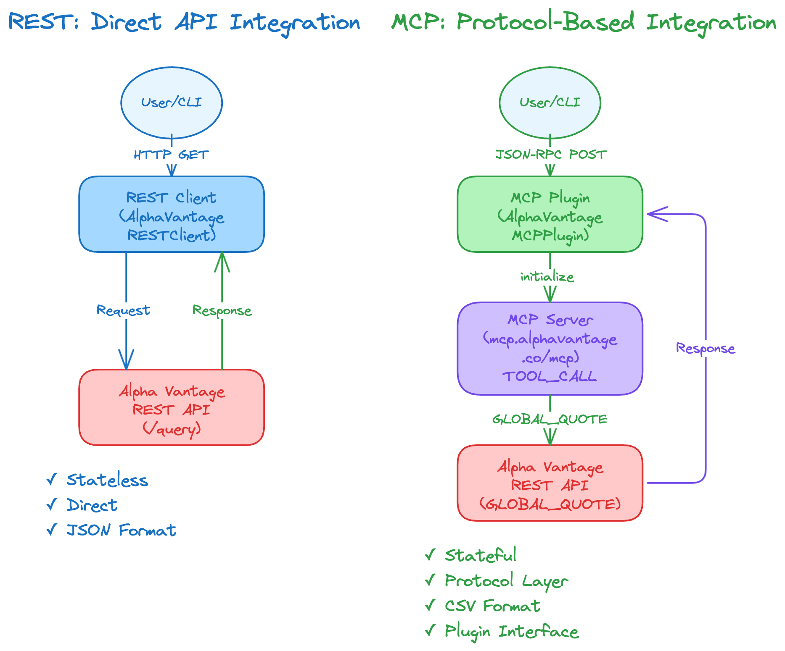

# REST vs MCP: Stock Data Fetching Comparison

This project demonstrates two different approaches to fetching stock data from Alpha Vantage:
1. **REST Example**: Traditional direct API integration
2. **MCP Example**: Model Context Protocol with plugin architecture

## Purpose

This is a learning project designed to showcase the architectural differences between:
- Direct REST API calls (tightly coupled, stateless)
- MCP protocol integration (abstracted, pluggable, stateful)

Both implementations fetch the same stock quote data, making it easy to compare the approaches.

## Architecture Comparison



**Visual comparison:** Side-by-side architecture diagrams showing REST (blue) vs MCP (green) approaches.

| Aspect | REST Approach | MCP Approach |
|--------|--------------|--------------|
| **Communication** | Direct HTTP GET requests | JSON-RPC over http |
| **Abstraction** | Minimal - direct endpoint calls | Protocol layer + plugin interface |
| **State** | Stateless - each request independent | Stateful session with MCP server |
| **Coupling** | Tightly coupled to Alpha Vantage API | Loosely coupled via plugin interface |
| **Swapping providers** | Requires code changes | Just swap plugin implementation |
| **Complexity** | Simple, straightforward | More setup, but more flexible |
| **Best for** | Single data source, simple needs | Multiple providers, modular architecture |

## Setup

### 1. Get an Alpha Vantage API Key

Visit [Alpha Vantage](https://www.alphavantage.co/support/#api-key) and get a free API key.

### 2. Install Dependencies

Using `uv` (recommended):
```bash
uv pip install -r requirements.txt
```

Or with pip:
```bash
pip install -r requirements.txt
```

### 3. Set API Key

```bash
export ALPHA_VANTAGE_API_KEY=your_api_key_here
```

Or create a `.env` file (copy from `.env.example`):
```bash
cp .env.example .env
# Edit .env and add your API key
```

## Usage

### REST Example

```bash
uv run rest_example/main.py IBM
```

Or without uv:
```bash
cd rest_example
python main.py IBM
```

This will:
1. Make a direct HTTP GET request to Alpha Vantage API
2. Parse the JSON response
3. Display the stock quote

### MCP Example

```bash
uv run mcp_example/main.py IBM
```

Or without uv:
```bash
cd mcp_example
python main.py IBM
```

This will:
1. Connect to the Alpha Vantage MCP server via http
2. Call the `get_quote` tool through MCP protocol
3. Display the same stock quote data

### Example Output

Both examples produce similar output:

```
Stock Quote - REST API
==================================================
Symbol:              IBM
Price:               $178.25
Change:              +2.15 (+1.22%)
Volume:              45123456
Latest Trading Day:  2026-06-04
==================================================
```

## Testing Different Symbols

Try various stock symbols:

```bash
uv run rest_example/main.py MSFT    # Microsoft
uv run rest_example/main.py GOOGL   # Google
uv run rest_example/main.py TSLA    # Tesla

uv run mcp_example/main.py MSFT     # Same symbols via MCP
uv run mcp_example/main.py GOOGL
uv run mcp_example/main.py TSLA
```

## Key Differences in Code

### REST Version (`rest_example/rest_stock_client.py`)
```python
# Direct HTTP call
response = requests.get(
    "https://www.alphavantage.co/query",
    params={'function': 'GLOBAL_QUOTE', 'symbol': symbol, 'apikey': api_key}
)
data = response.json()
```

### MCP Version (`mcp_example/alphavantage_mcp_plugin.py`)
```python
# MCP protocol call
result = await self.session.call_tool(
    "get_quote",
    arguments={"symbol": symbol}
)
```

### Plugin Interface (`mcp_example/stock_plugin.py`)
```python
class StockDataPlugin(ABC):
    @abstractmethod
    def get_quote(self, symbol: str) -> Dict:
        pass
```

This interface makes it trivial to add other MCP stock servers:
- `FinnhubMCPPlugin`
- `PolygonMCPPlugin`
- `YahooFinanceMCPPlugin`

Just implement the `StockDataPlugin` interface and swap it in `main.py`.

## Error Handling

Both examples handle common errors:
- Missing API key
- Invalid stock symbol
- Network failures
- API rate limits (free tier: 25 requests/day)

## Learning Takeaways

1. **REST is simpler** for single-source integrations - less boilerplate, direct control
2. **MCP provides abstraction** that shines when you need to support multiple data sources
3. **Plugin pattern** (in MCP example) makes swapping providers trivial without changing client code
4. **Protocol layer** adds overhead but provides standardization and future flexibility
5. **Both approaches** can achieve the same result - choose based on your needs

## Next Steps

To extend this project:
- Add more MCP plugins (Finnhub, Polygon, etc.)
- Implement historical data fetching
- Add caching layer
- Create a unified CLI that switches between REST and MCP
- Build a web UI that uses both backends

## Resources

- [Alpha Vantage API Documentation](https://www.alphavantage.co/documentation/)
- [Model Context Protocol Documentation](https://modelcontextprotocol.io/)
- [MCP Python SDK](https://github.com/anthropics/python-sdk)

## License

This is a learning project - use freely for educational purposes.
